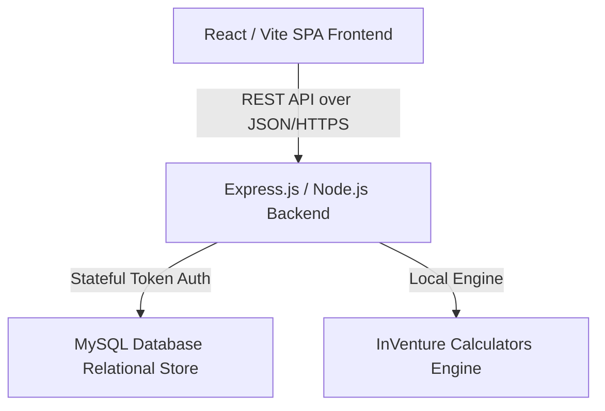

# InVenture: Enterprise-Grade Startup Incubation Suite & Cap Table Modeler

InVenture is a comprehensive, three-tier web application designed for startup incubators, early-stage founders, and venture capital investors. It provides automated financial modeling, capital structure analysis, and incubation pipeline management.

---

## 🏗️ System Architecture

The application is built on a decoupled, client-server model using the following technology stack:



- **Frontend**: Single Page Application (SPA) built with **React 18** and **Vite**. Data visualization is handled reactively using **Chart.js** and **react-chartjs-2**. Styles are implemented using custom vanilla CSS variables for fluid, low-overhead layout rendering.
- **Backend**: **Node.js** with **Express.js** handling middleware execution, session security, and database connectivity.
- **Database**: Relational database storage using **MySQL** (`mysql2` client), supporting referential integrity constraints, automated cascade deletions, and index optimization for fast queries.
- **Authentication**: Stateless, cryptographically signed token auth using **JSON Web Tokens (JWT)** and **bcryptjs** password hashing (using a Work Factor / Salt Rounds parameter of 10).

---

## 🧮 Mathematical Modeling Engine (`calculators.js`)

At the core of InVenture is a custom deterministic calculations engine handling venture math.

### 1. Burn Rate & Runway Analysis
Calculates the operational runway and required financing before capital exhaustion:

$$\text{Monthly Burn Rate} = \max(0, \text{Monthly Expenses} - \text{Monthly Revenue})$$

$$\text{Runway (Months)} = \begin{cases} \frac{\text{Current Cash}}{\text{Monthly Burn Rate}}, & \text{if Monthly Burn Rate} > 0 \\ \infty, & \text{if Monthly Burn Rate} \le 0 \end{cases}$$

$$\text{Funding Needed} = \max(0, (\text{Desired Runway} - \text{Runway (Months)}) \times \text{Monthly Burn Rate})$$

### 2. SAFE (Simple Agreement for Future Equity) Conversion
When a priced equity round is initiated, SAFE agreements convert to equity based on a **valuation cap** and/or a **discount rate**. The engine resolves the conversion price per share as:

$$\text{Base Share Price} = \frac{\text{Pre-Money Valuation}}{\text{Total Pre-Round Shares}}$$

$$\text{Cap Conversion Price} = \frac{\text{Valuation Cap}}{\text{Total Pre-Round Shares}}$$

$$\text{Discounted Price} = \text{Base Share Price} \times (1 - \text{Discount Rate})$$

$$\text{SAFE Conversion Price} = \min(\text{Base Share Price}, \text{Cap Conversion Price}, \text{Discounted Price})$$

$$\text{Shares Issued to SAFE Holder} = \frac{\text{SAFE Investment Amount}}{\text{SAFE Conversion Price}}$$

### 3. Option Pool Top-up & Dilution Options
The engine models option pools constructed under two distinct scenarios:

- **Pre-Money Option Pool** (Dilutes existing shareholders / founders):
  The option pool size is configured as a percentage of the post-money cap table but allocated prior to the investment.
  $$\text{Total Post-Round Shares} = \frac{\text{Pre-Round Shares} + \text{SAFE Shares}}{1 - \text{New Investor \%} - \text{Option Pool \%}}$$
- **Post-Money Option Pool** (Dilutes all shareholders including new investors):
  $$\text{Intermediate Shares} = \frac{\text{Pre-Round Shares} + \text{SAFE Shares}}{1 - \text{New Investor \%}}$$
  $$\text{Total Post-Round Shares} = \frac{\text{Intermediate Shares}}{1 - \text{Option Pool \%}}$$

---

## 🗄️ Relational Database Schema (`schema.sql`)

The database uses a structured schema mapping the entities shown below:

```sql
-- 1. Users Table
-- Manages platform credentials, system roles (admin, founder, investor) and cryptographic hashes.
CREATE TABLE users (
    id INT AUTO_INCREMENT PRIMARY KEY,
    name VARCHAR(255) NOT NULL,
    email VARCHAR(255) UNIQUE NOT NULL,
    password VARCHAR(255) NOT NULL,
    role VARCHAR(50) NOT NULL
);

-- 2. Startups Table
-- Tracks operational metrics, cash positions, revenues, and runway risk status.
CREATE TABLE startups (
    id INT AUTO_INCREMENT PRIMARY KEY,
    name VARCHAR(255) NOT NULL,
    founder_id INT NOT NULL,
    industry VARCHAR(100) NOT NULL,
    stage VARCHAR(50) NOT NULL,
    funding_needed DECIMAL(15, 2) NOT NULL,
    description TEXT,
    cash DECIMAL(15, 2) NOT NULL,
    revenue DECIMAL(15, 2) NOT NULL,
    expenses DECIMAL(15, 2) NOT NULL,
    progress INT DEFAULT 0,
    at_risk BOOLEAN DEFAULT FALSE,
    FOREIGN KEY (founder_id) REFERENCES users(id) ON DELETE CASCADE
);

-- 3. Cap Table Table
-- Tracks ownership distribution before equity round simulations.
CREATE TABLE cap_table (
    id INT AUTO_INCREMENT PRIMARY KEY,
    startup_id INT NOT NULL,
    stakeholder_name VARCHAR(255) NOT NULL,
    shares INT NOT NULL,
    is_founder BOOLEAN DEFAULT FALSE,
    FOREIGN KEY (startup_id) REFERENCES startups(id) ON DELETE CASCADE
);
```

Other key schema tables include:
- `feedbacks`: Stores pitch evaluations, numerical ratings, and categorizations (e.g., Product, Market, Team).
- `investor_preferences`: Allows investors to set criteria matching targets for pipeline discovery (minimum/maximum capital thresholds, industry sectors).
- `shortlists`: Implements pipeline stage tracking (`shortlisted`, `interested`) for investor sourcing workflows.

---

## ⚡ Deployment & Routing Configuration

The repository contains environment settings for zero-overhead deployment on **Vercel** via serverless functions.

### API Rewrite Configuration (`vercel.json`)
The application redirects all incoming backend queries to a centralized entrypoint:

```json
{
  "rewrites": [
    {
      "source": "/api/(.*)",
      "destination": "/api/index.js"
    }
  ]
}
```

This acts as a serverless gateway invoking `backend/server.js` which manages routing handlers.

---

## 🛠️ Local Development Setup

### Backend (Express API)
1. Navigate to the backend directory:
   ```bash
   cd backend
   ```
2. Install dependencies:
   ```bash
   npm install
   ```
3. Set up the `.env` file with your database credentials:
   ```env
   PORT=5000
   DB_HOST=localhost
   DB_USER=root
   DB_PASSWORD=your_password
   DB_NAME=inventure_db
   JWT_SECRET=your_jwt_signing_key
   ```
4. Seed the database with `schema.sql`.
5. Spin up the local development daemon:
   ```bash
   npm run dev
   ```

### Frontend (React + Vite SPA)
1. Navigate to the frontend directory:
   ```bash
   cd ../frontend
   ```
2. Install dependencies:
   ```bash
   npm install
   ```
3. Boot the Vite hot-reloading dev server:
   ```bash
   npm run dev
   ```
4. Access the client client dashboard at `http://localhost:5173`.
